# 深度神经网络验证与测试的相关研究工作调研

| Recorder                                            | Date      | Categories                                           |
| --------------------------------------------------- | --------- | ---------------------------------------------------- |
| Liu Yuehao、Xing Hengrui、Zhao Liang、Wang Wensheng | 2025-1-26 | Neural Network Verification, Neural Network Testing |

### **引言**

#### 调研背景

深度神经网络（DNN）近年来在图像识别、自然语言处理等领域取得了显著成果，并逐渐应用于自动驾驶、医疗诊断等安全关键领域。然而，深度神经网络的复杂性和非线性特性使得其决策过程难以解释，尤其是在语义分割神经网络和卷积神经网络（CNN）中，模型的输出往往依赖于复杂的特征提取和空间信息处理，这可能导致可信性争议。为确保这些网络在部署前满足设计需求、符合功能规范并遵守安全伦理约束，对其进行严格的验证与测试成为不可或缺的环节。

DNN验证的核心目标是通过系统化的方法确保模型的行为符合预期，并能够在各种场景下保持可靠性和安全性。具体而言，验证方法包括形式化验证、需求验证、鲁棒性验证以及伦理合规性验证等多种形式。在语义分割神经网络中，形式化验证可以通过数学工具（如可达性分析、抽象解释）证明模型在特定输入空间内满足预设的安全属性，确保分割结果的准确性和一致性。对于卷积神经网络，需求验证则通过构建验证场景和边界值分析，确保模型输出符合功能规范和领域知识，特别是在图像分类和目标检测任务中，验证模型的输出是否与预期一致。

与此同时，深度神经网络的测试同样至关重要。深度神经网络的复杂性和不透明性带来了潜在的安全隐患，例如对抗样本攻击、模型偏见等问题，可能导致模型在实际应用中做出错误决策，甚至引发严重后果。因此，为确保深度神经网络的可靠性、安全性和可信性，对其进行全面系统的测试至关重要。DNN测试主要分为白盒测试和黑盒测试两大类：白盒测试需要了解模型的内部结构、参数和训练数据等信息，利用这些信息设计测试用例，覆盖不同的代码路径、神经元激活情况和决策边界，从而发现模型潜在的缺陷和漏洞；黑盒测试则将模型视为一个黑盒子，无需了解其内部细节，通过分析模型的输入输出关系，设计测试用例来评估模型的鲁棒性、公平性和泛化能力等。

#### 调研目的

本次调研旨在探讨深度神经网络（DNN）验证与测试的核心方法和技术，分析其在语义分割神经网络和卷积神经网络中的应用场景与技术挑战。通过形式化验证、鲁棒性验证、伦理合规性验证以及基于覆盖度量的测试用例生成，为构建可证明安全的DNN系统提供方法论指导，推动可信人工智能的落地实践。同时，本报告将结合具体案例，详细阐述验证与测试的过程，以期为DNN技术的安全可靠应用提供参考。

### 相关工作一：语义分割与卷积神经网络的鲁棒性验证

深度神经网络（DNN）近年来在图像识别、自然语言处理等领域取得了显著成果，并逐渐应用于自动驾驶、医疗诊断等安全关键领域。然而，DNN的复杂性和非线性特性使得其决策过程难以解释，尤其是在语义分割神经网络和 卷积神经网络（CNN）中，模型的输出往往依赖于复杂的特征提取和空间信息处理，这可能导致可信性争议。为确保这些网络在部署前满足设计需求、符合功能规范并遵守安全伦理约束，对其进行严格的验证成为不可或缺的环节。

DNN验证的核心目标是通过系统化的方法确保模型的行为符合预期，并能够在各种场景下保持可靠性和安全性。具体而言，验证方法包括形式化验证、需求验证、鲁棒性验证以及伦理合规性验证等多种形式。在语义分割神经网络中，形式化验证可以通过数学工具（如可达性分析、抽象解释）证明模型在特定输入空间内满足预设的安全属性，确保分割结果的准确性和一致性。对于卷积神经网络，需求验证则通过构建验证场景和边界值分析，确保模型输出符合功能规范和领域知识，特别是在图像分类和目标检测任务中，验证模型的输出是否与预期一致。

鲁棒性验证在语义分割和卷积神经网络中尤为重要，尤其是在面对对抗样本、噪声干扰等异常条件下，模型的表现是否依然可靠。例如，在语义分割任务中，验证模型是否能够在噪声图像中保持分割边界的准确性；在卷积神经网络中，验证模型是否能够在对抗攻击下保持分类的稳定性。此外，伦理合规性验证通过公平性测试和偏见检测，确保模型决策符合社会伦理和法律要求，特别是在医疗图像分割和自动驾驶等高风险应用中，避免因模型偏见导致的决策失误。

本报告将系统阐述DNN验证的核心方法和技术，以两篇核心论文为例，详细阐述验证的过程，特别是针对语义分割神经网络和卷积神经网络的验证方法。通过形式化验证、鲁棒性验证和伦理合规性验证的结合，为构建可证明安全的DNN系统提供方法论指导，推动可信人工智能的落地实践。

#### 相关论文一  Robustness Verification of Semantic Segmentation Neural Networks Using Relaxed Reachability

##### 背景介绍

语义分割网络（SSN）是深度神经网络（DNN）的一种，广泛应用于自动驾驶、医疗影像等领域。与图像分类不同，语义分割需要对图像中的每个像素进行分类，输出空间与输入空间的维度相同，这使得其验证更加复杂。尽管近年来在DNN的鲁棒性验证方面取得了进展，但针对SSN的鲁棒性验证方法仍然缺乏。本文旨在填补这一空白，提出了一种基于松弛可达性分析的SSN鲁棒性验证方法。具体来说，本文的主要贡献包括：

1. **首次提出SSN的鲁棒性验证方法** ：通过可达性分析，构建输入图像的扰动范围，并计算每个像素的可能输出类别，从而验证SSN在像素级别的鲁棒性。
2. **松弛可达性方法** ：提出了一种新的松弛ImageStar可达性方法，允许用户通过松弛因子（RF）选择在构建可达集时解决的线性规划问题（LP）的百分比，从而显著减少验证时间。
3. **实现与评估** ：将方法实现于NNV工具中，并在MNIST和M2NIST数据集上进行了评估，验证了不同SSN架构的鲁棒性和验证性能。

本文的方法主要基于ImageStar数据结构，通过逐层计算可达集来验证SSN的鲁棒性。特别地，本文处理了上采样层（如转置卷积）的可达性分析，并提出了针对ReLU层和像素分类层的松弛可达性方法。

##### 本文方法

1. **SSN的鲁棒性验证方法**
   NNV的算法部分详细描述了如何通过松弛可达性分析来验证语义分割网络（SSN）的鲁棒性。算法首先根据对抗攻击构建输入集，表示输入图像在扰动范围内的所有可能变化。接着，算法逐层计算网络的可达集 $Rf$，即每个像素在扰动下可能输出的类别集合。对于每一层，算法特别处理了上采样层（如转置卷积和空洞卷积）和 ReLU 层的可达性分析，并通过松弛因子控制线性规划问题（LP）的求解比例，从而在保证验证精度的同时显著减少计算时间。最后，算法通过比较可达集与原始输出 $y=f(x)$的差异，计算每个像素的鲁棒性值 $RV$、鲁棒性敏感度 $RS$ 和鲁棒交并比$R_{IoU}$。实验结果表明，该方法在 MNIST 和 M2NIST 数据集上能够有效验证 SSN 的鲁棒性，并在验证时间上实现了显著优化。
   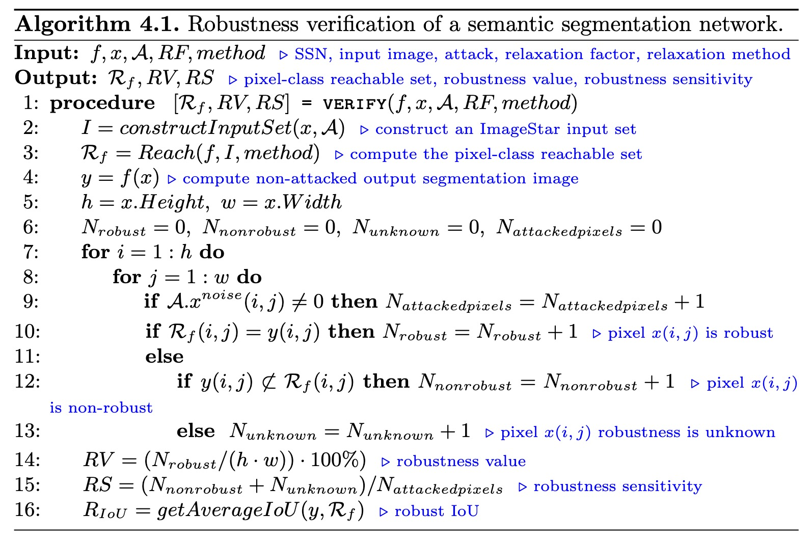
2. **松弛可达性方法**

   传统的可达性分析需要精确计算每一层的输出范围，这通常涉及大量的线性规划问题（LP），尤其是在处理包含大量 ReLU 激活函数的深度神经网络时，计算复杂度非常高。为了减少计算时间，本文提出了一种 $松弛可达性方法$ ，允许用户通过松弛因子 $RF$ 控制需要解决的线性规划问题的比例。具体来说，松弛因子 $RF$ 表示在构建可达集时跳过的 LP 问题的百分比（例如，$RF=50\%$ 表示只解决 50% 的 LP 问题），从而在保证验证精度的同时显著减少计算时间。
   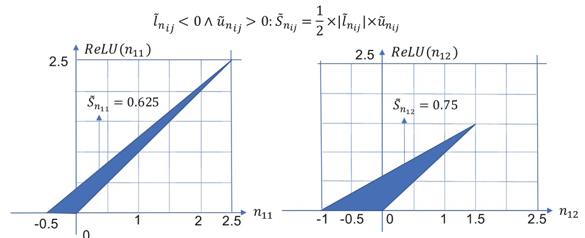
3. **ImageStar** 方法是一种用于深度神经网络（尤其是卷积神经网络，CNN）可达性分析的高效数据结构。它通过表示输入图像的扰动范围，逐层计算网络的可达集，从而验证模型的鲁棒性。以下是 ImageStar 方法的详细介绍：ImageStar 是一种用于表示图像集合的数据结构，特别适合处理带有扰动的输入图像。它的核心思想是将输入图像的扰动范围表示为一个 **星形集合** （Star Set），并通过线性约束来描述这些扰动。具体来说，ImageStar 通过以下组件定义

   * **锚点图像（Anchor Image）** ：表示未扰动的原始图像。
   * **生成器图像（Generator Images）** ：表示扰动方向，用于描述输入图像可能的变化范围。
   * **谓词（Predicate）** ：通过线性约束定义扰动的边界条件。
     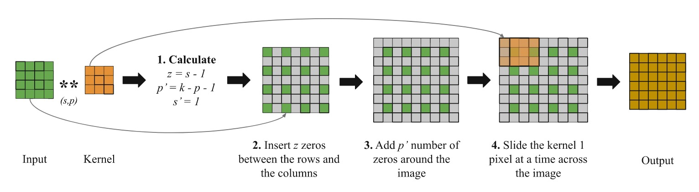

##### 实验效果

本文在MNIST和M2NIST数据集上进行了广泛的实验，评估了不同SSN架构的鲁棒性和验证性能。实验结果表明：

1. **平均池化 vs. 最大池化** ：使用平均池化的SSN在鲁棒性和验证性能上优于使用最大池化的SSN。最大池化虽然提高了模型的非线性特性，但也增加了模型的敏感性和验证时间。
2. **ReLU层的影响** ：ReLU层虽然有助于提高模型的准确性，但也显著增加了模型的非线性，导致鲁棒性下降和验证时间增加。
3. **转置卷积 vs. 扩张卷积** ：使用转置卷积的SSN在鲁棒性和验证性能上优于使用扩张卷积的SSN。
4. **松弛可达性方法的有效性** ：松弛可达性方法显著减少了验证时间，特别是在ReLU层占主导的SSN中，验证时间最多可减少99%。

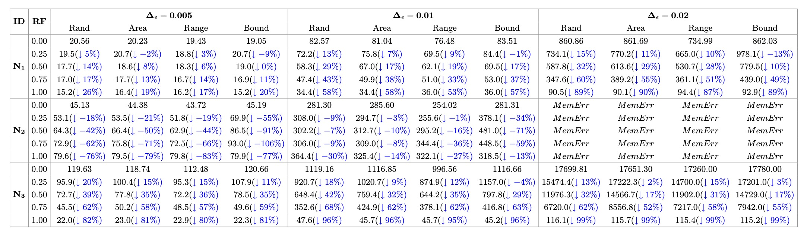

##### 总结

本文提出了首个基于松弛可达性分析的SSN鲁棒性验证方法，填补了该领域的研究空白。通过实验，本文展示了不同SSN架构在鲁棒性和验证性能上的差异，并验证了松弛可达性方法在减少验证时间方面的有效性。未来的工作将探索针对最大池化层的松弛启发式方法，并扩展该方法以处理编码器-解码器架构的SSN。本文的研究为SSN的安全可靠应用提供了重要的理论和方法支持，推动了可信人工智能技术的发展。

#### 相关论文二 Towards General Robustness Verification of MaxPool-based Convolutional  Neural Networks via Tightening Linear Approximation

论文连接：https://openaccess.thecvf.com/content/CVPR2024/html/Xiao_Towards_General_Robustness_Verification_of_MaxPool-based_Convolutional_Neural_Networks_via_CVPR_2024_paper.html

##### 背景介绍

卷积神经网络（CNNs）在语音识别、图像分类等领域取得了显著的成功。然而，CNN在面对环境扰动和对抗攻击时往往表现出脆弱性，这可能导致在自动驾驶、人脸识别等安全关键领域中的灾难性后果。因此，在部署网络之前，提供形式化和确定性的鲁棒性保证是必不可少的。鲁棒性验证的方法可以分为两类：**完备验证**和 **不完备验证** 。完备验证方法可以在不损失精度的情况下验证分段线性网络的鲁棒性，但在处理更复杂的网络结构时往往失效。不完备但可靠的验证方法则旨在扩展到不同类型的CNN。CNN鲁棒性验证的主要挑战来自于其非线性特性，尤其是MaxPool函数，它虽然广泛使用，但验证起来非常复杂。

为了解决这些问题，文章提出了一种新的鲁棒性验证框架—— **MaxLin** ，通过紧致线性近似来验证基于MaxPool的CNN的鲁棒性。MaxLin通过最小化MaxPool函数的上界线性近似和最大化下界线性近似的精度，能够为CNN提供更大的认证下界。
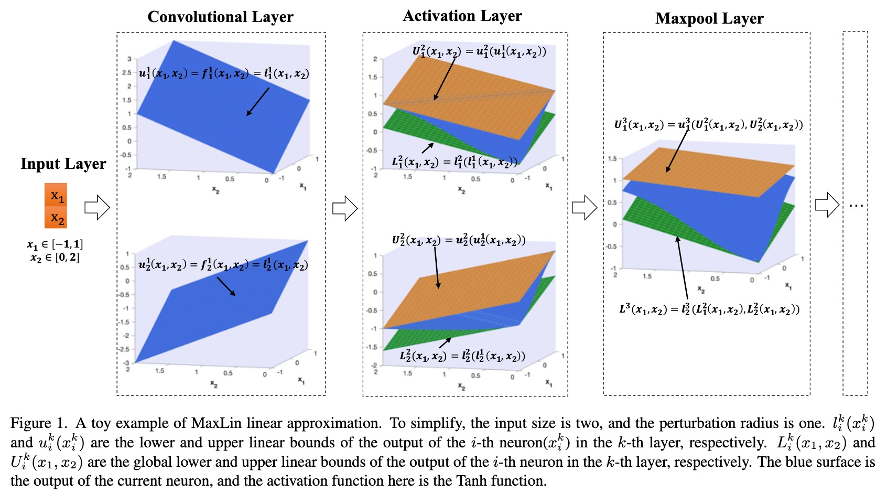

##### 本文方法

1. MaxPool的紧致线性近似
   本文提出了MaxPool函数的线性近似方法，通过选择输入的上界和下界中的最大值和次大值，直接给出线性近似。具体来说，MaxPool的线性近似分为两种情况：
   1. **上界线性近似** ：根据输入的最大值和次大值，选择不同的线性近似方式。
   2. **下界线性近似** ：选择输入的平均值最大的神经元作为下界。
      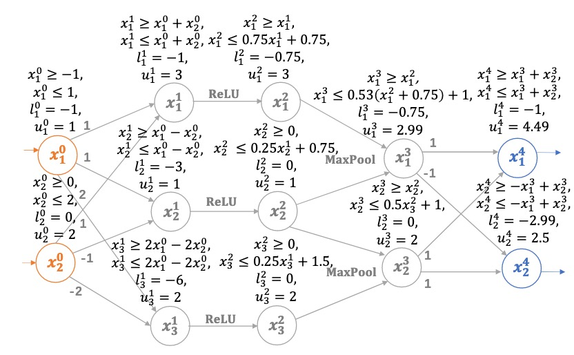
2. 块级紧致性
   现有的方法大多基于神经元级别的紧致性，忽略了神经元之间的交互作用。本文引入了块级紧致性的概念，即在ReLU+MaxPool块的全局线性近似中，最小化过近似区域的体积。本文证明了在ReLU的上界线性近似不精确的情况下，MaxLin的上界线性近似是块级紧致的。
3. 认证下界的计算
   MaxLin通过两层过程计算认证下界：
   1. **计算全局上下界**：通过逐层线性近似，计算网络输出的全局上下界。
   2. **搜索最大认证下界**：使用二分搜索算法，找到最大的认证下界。
      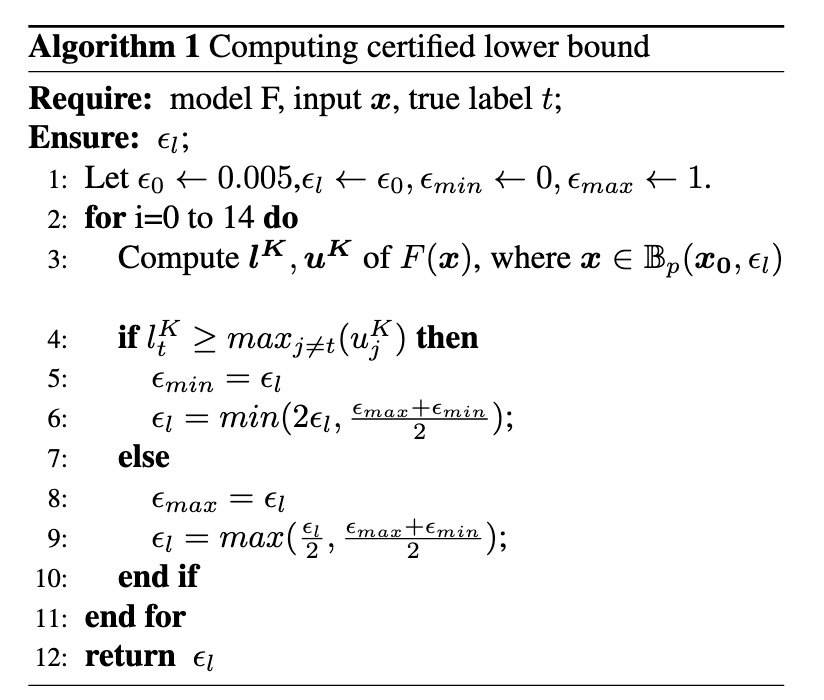

##### 实验效果

该文章在MNIST、CIFAR-10和Tiny ImageNet数据集上对MaxLin进行了广泛的实验评估，并与现有的最先进工具（如CNN-Cert、DeepPoly、3DCertify和Ti-Lin）进行了比较。实验结果表明：

1. **紧致性** ：MaxLin在认证下界方面显著优于现有工具，提升幅度最高达110.60%。
2. **效率** ：MaxLin在计算速度上比3DCertify快5.13倍，且与CNN-Cert、DeepPoly和Ti-Lin的效率相当。
3. **块级紧致性** ：MaxLin在ReLU+MaxPool块的过近似区域体积上表现最优，验证了其块级紧致性。
   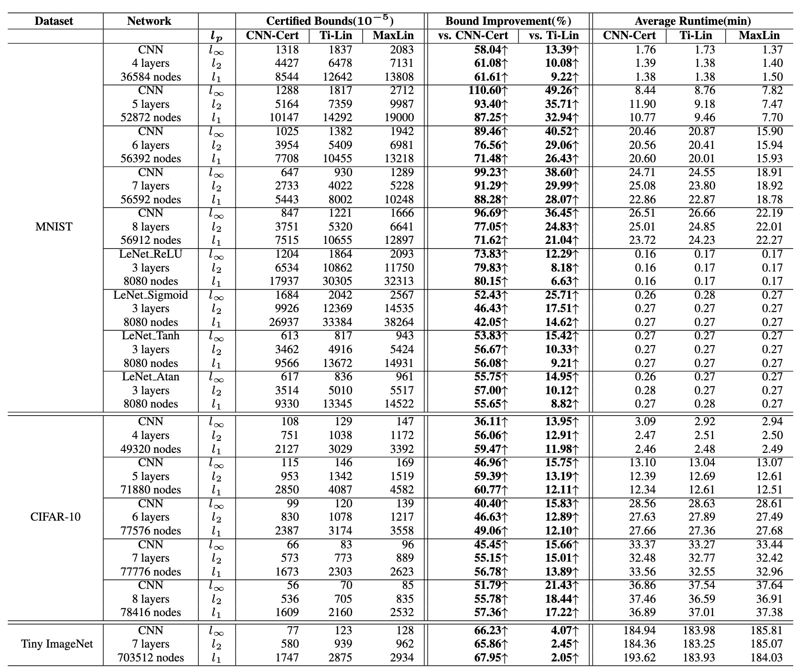
   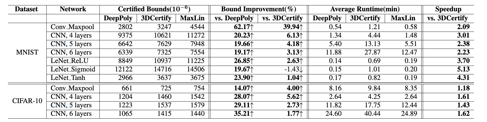

##### 总结

本文提出了MaxLin，一种基于紧致线性近似的MaxPool鲁棒性验证框架。MaxLin通过紧致线性近似，能够为CNN提供更大的认证下界，并且在计算效率上优于现有的最先进工具。实验结果表明，MaxLin在紧致性和效率方面均表现出色，特别是在复杂数据集上表现尤为突出。未来，MaxLin可以进一步扩展到其他类型的神经网络（如循环神经网络和Transformer），并在更多实际应用场景中进行验证。

### 相关工作二：基于覆盖度量的深度神经网络测试用例生成

深度神经网络（DNN）近年来在图像识别、自然语言处理等领域取得了显著成果，并逐渐应用于自动驾驶、医疗诊断等安全关键领域。然而，DNN的复杂性和不透明性也带来了潜在的安全隐患，例如对抗样本攻击、模型偏见等问题，可能导致模型在实际应用中做出错误决策，甚至引发严重后果。因此，为确保DNN的可靠性、安全性和可信性，对其进行全面系统的测试至关重要。DNN测试主要分为白盒测试和黑盒测试两大类：白盒测试需要了解模型的内部结构、参数和训练数据等信息，利用这些信息设计测试用例，覆盖不同的代码路径、神经元激活情况和决策边界，从而发现模型潜在的缺陷和漏洞；黑盒测试则将模型视为一个黑盒子，无需了解其内部细节，通过分析模型的输入输出关系，设计测试用例来评估模型的鲁棒性、公平性和泛化能力等。本报告将分别介绍DNN白盒测试和黑盒测试的常用方法和技术，并结合具体案例进行分析，以期为DNN测试实践提供参考，推动DNN技术的安全可靠应用。

#### 相关论文一 Neuron Semantic-Guided Test Generation for Deep Neural Networks Fuzzing

论文连接：https://dl.acm.org/doi/10.1145/3688835

深度神经网络（DNN）在图像分类、计算机视觉、语音识别、自然语言处理等领域取得了显著进展，并广泛应用于自动驾驶、医疗诊断等安全关键场景。然而，DNN的复杂性和黑盒特性使其在部署前难以充分测试，任何未检测到的错误都可能导致严重的后果。现有的DNN测试方法主要依赖于覆盖率准则（如神经元覆盖率、层级覆盖率、路径覆盖率等），这些准则通过衡量测试输入对模型内部状态的覆盖程度来评估测试的充分性。然而，这些方法存在以下问题：

1. **测试充分性不足**：现有的覆盖率准则（如神经元覆盖率）往往过于简单，无法有效捕捉模型内部的复杂行为。例如，某些准则仅关注神经元的激活状态，而忽略了神经元之间的语义关系，导致生成的测试输入无法充分挑战模型的决策边界。
2. **可解释性差**：现有准则缺乏对神经元语义的解释，测试人员无法理解测试输入触发了模型的哪些错误属性或模式。这种缺乏可解释性的情况使得测试结果难以用于后续的调试和修复。
3. **多样性不足**：现有准则生成的测试输入往往集中在某些特定的决策路径上，未能充分探索模型的决策边界，导致潜在的缺陷未被发现。
   为了解决这些问题，本文提出了一种新的DNN模糊测试方法——**Neuron Semantic-Guided Test Generation (NSGen)**，旨在通过利用神经元的语义信息生成更具多样性和可解释性的测试输入，从而更有效地揭示DNN中的潜在缺陷。

##### 本文方法

下图展示了NSGen的整体架构，算法1则详细说明了其具体步骤。NSGen通过**决策路径差异（DPD）**来驱动模糊测试，DPD由两个关键组件组成：**神经元-描述对生成**和**测试输入生成**。我们首先生成神经元-描述对。接下来，我们根据神经元对DNN预测结果的贡献来选择原始图像和突变图像的关键神经元。最后，我们将神经元描述组装起来，并将其映射到文本-视觉多模态空间中，以计算相似度。

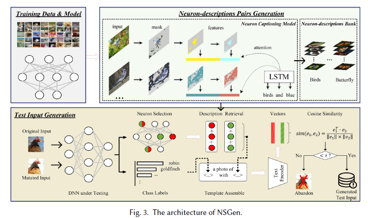

NSGen的详细工作流程如算法1所示。我们使用相似度度量**sim**作为指导标准，来引导输入突变过程。NSGen的输入包括突变规则TT（见第5.2节）、模糊测试种子SS、试验次数、**对比语言-图像预训练（CLIP）**模型作为文本编码器，以及待测试的DNN DD。在启动模糊测试循环之前，我们首先设置相似度阈值（第2行，见第4.3.4节），并生成神经元-描述对（第3行，见第4.2节）以供后续使用。在模糊测试过程中，考虑到有限的测试资源，我们设置了一个终止条件，例如当算法的迭代次数达到10,000次或运行时间超过6小时时（第4行）。一旦达到终止条件，模糊测试过程将停止。否则，模糊测试器将从模糊测试种子池中采样（第5行），并进行突变（第6-8行）。由于随机突变可能会产生无意义的种子，模糊测试器会谨慎评估每个突变种子的有效性（第10行）。对于每个从原始种子派生的有效突变体，NSGen从神经元-描述对库中检索相应的神经元描述（第11-14行，见第4.3.1节）。随后，构建一个模板，并计算突变体与原始种子之间的余弦相似度。然后，将相似度分数与预定的阈值进行验证，以确定突变体是否符合预期的测试输入（第15-21行，见第4.3.2和4.3.3节）。

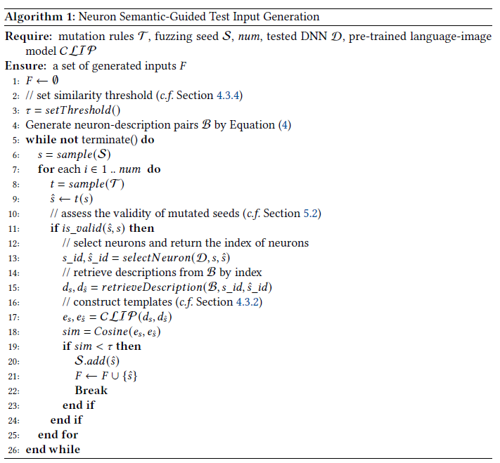

接下来将详细介绍上述所提及的一些概念

1. **神经元-描述对生成**：

   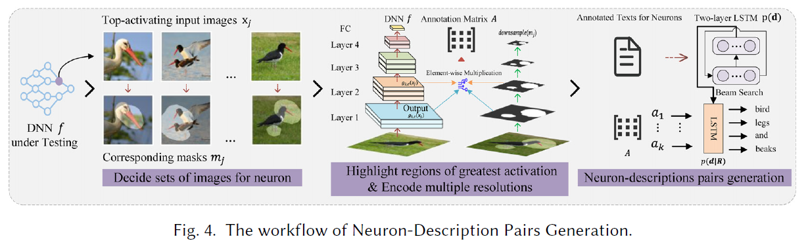

   - 构建神经元的示例表示: 对于每个神经元，我们选择**k**个激活最高的图像（即神经元表示 $R$ ），其中 $k=15$，遵循之前论文中的设置来描述神经元语义。此外，对于每个激活的图像，我们分配一个相应的掩码 $m_j$，以强调激活最高的区域。如上图所示，展示了一系列鸟类图像（激活最高的图像）及其对应的掩码。每个掩码准确地突出了图像中神经元活动最显著的区域，例如喙和腿。我们的目标是根据**k**个激活最高的图像的突出区域来表征神经元的语义。该过程涉及确定图象集、突出激活最高区域以及编码多分辨率。
   - 神经元-描述对生成: 我们将进行解码并排序神经元的自然语言描述，如上图所示，涉及两个解码过程。我们计算人类使用自然语言描述来描述图像区域（即**k**个激活最高的图像）的概率 $p(d|R)$，以及使用描述 $d$ 来描述任何神经元的概率 $p(d)$。在解码描述的过程中，搜索被限制在一组在 $p(d|R)$ 下具有高概率的候选描述中，并根据公式下述进行排序。具体来说，我们在 $p(d|R)$ 上进行束搜索，并在最终搜索步骤后使用完整的束（即束大小设置为50）作为候选描述集。从这个集合中，我们选择排名第一的描述。

     $$
     d(f_i) = \arg \max_{d_i} (\log p(d_i|R_i)-\log p(d_i)).
     $$
2. **测试输入生成**：

   - 神经元选择: 在生成并存储描述后，重点选择对输入具有重要意义的神经元。如果一个神经元对模型在输入上的预测结果有显著影响，即其输出表现出较高的贡献值，则该神经元被认为是重要的。为了识别这些关键神经元，利用**积分梯度**来计算每个神经元对最终预测的贡献分数。因此，我们可以确定卷积层中神经元对原始（突变）图像的贡献。
   - 模板构建：一旦我们为每个输入确定了重要神经元，下一步就是构建一个模板来组装这些神经元的相应描述。直观上，结合视觉上下文的描述可以提供有关测试输入的宝贵附加信息，从而产生更精确的自然语言描述。例如，在“一张猫的照片”中添加“在草地上”可以帮助将其与其他在不同背景下拍摄的猫的照片区分开来。因此，我们从两个角度组装测试输入的自然语言描述：模型预测的类别标签和一些关键神经元的描述。神经元描述提供了模型预测所基于的语义特征的见解，而类别标签则提供了上下文信息。为了构建文本提示，我们使用模板“一张<…><…>的照片，带有<…><…>”。前一个占位符代表类别标签，而后一个占位符包含神经元的自然语言描述。具体来说，我们打乱模型预测的类别标签的顺序，并使用连词“或”连接它们，而对于从描述库中检索到的神经元描述，我们按DNN层的顺序用逗号连接它们。至此，我们已经将测试输入的神经元语义构建成一个神经元语义决策路径。
   - 相似度计算：在将原始图像及其变异图像的神经元语义决策路径组装成模板后，我们使用CLIP作为默认的文本编码器，将这些模板映射到文本-视觉多模态空间中，以计算决策路径之间的细粒度相似度。

NSGen的核心创新在于引入了**决策路径差异（DPD）**作为指导准则。DPD通过量化原始测试输入和变异测试输入之间的语义差异，确保生成的测试输入能够有效探索DNN的决策边界，并揭示潜在故障。

##### 实验效果

NSGen在多个DNN模型（VGG16_BN、ResNet50、MobileNet_v2）和数据集（CIFAR10、CIFAR100、Oxford 102 Flower、ImageNet）上进行了广泛的实验评估，实验结果表明：

1. **故障检测能力**：

   - 与12种现有的覆盖率准则相比，NSGen触发的故障数量显著增加，增幅为21.4%至61.2%。特别是在复杂数据集（如CIFAR100和ImageNet）上，NSGen表现出更强的故障检测能力。
   - NSGen生成的测试输入能够更有效地挑战模型的决策边界，揭示更多的潜在缺陷。

   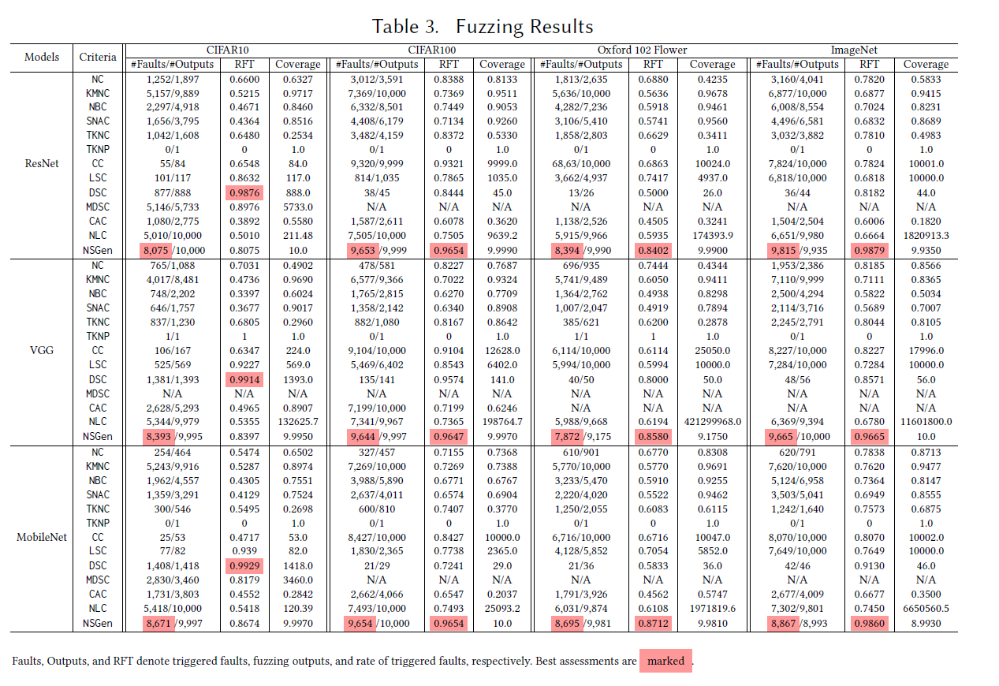
2. **多样性**：

   - NSGen生成的测试输入覆盖了更多的类别，特别是在复杂数据集（如CIFAR100和ImageNet）上表现尤为突出。例如，在ImageNet数据集上，NSGen生成的测试输入覆盖了751个类别，比最先进的覆盖率准则多覆盖了51个类别。
   - 通过引入神经元语义信息，NSGen能够生成更具多样性的测试输入，从而更全面地探索模型的决策空间。

   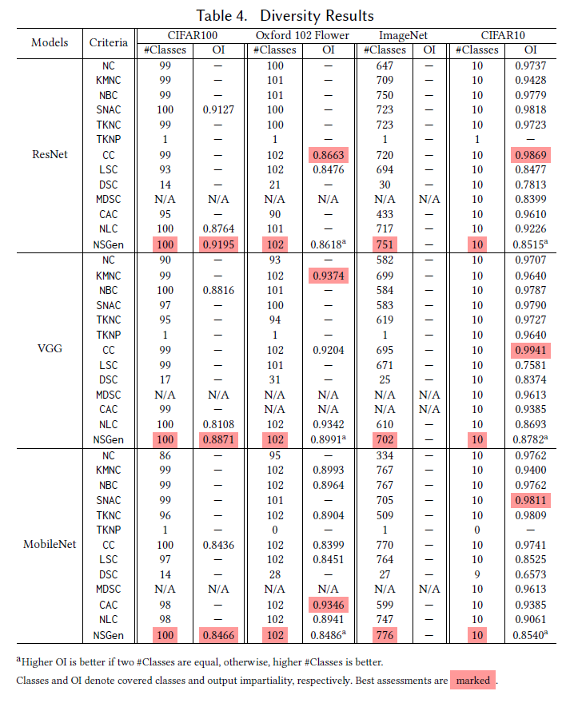
3. **效率**：

   - NSGen在生成故障揭示测试输入的时间效率上排名前3，表现出较高的时间效率。例如，在CIFAR100数据集上，NSGen生成一个故障揭示测试输入的平均时间为0.8秒。
   - 尽管NSGen在生成测试输入时需要额外的语义分析和相似性计算，但其时间效率仍然优于大多数现有的覆盖率准则。
4. **可解释性**：

   - NSGen通过提供基于神经元语义的决策路径，增强了DNN决策过程的可解释性。测试人员可以通过分析决策路径，理解模型在处理特定输入时的内部决策过程，从而更好地定位和修复模型中的缺陷。
   - 例如，NSGen能够解释模型在处理一张鸟类图像时，如何通过识别“喙”和“翅膀”等特征最终将其分类为“bulbul”，而在图像变异后，模型如何错误地将其分类为“indri”。

##### 总结

NSGen通过引入神经元语义信息，提出了一种新的DNN模糊测试方法，能够生成更具多样性和可解释性的测试输入，从而更有效地揭示DNN中的潜在缺陷。实验结果表明，NSGen在故障检测能力、多样性和效率方面均优于现有的覆盖率准则，特别是在复杂数据集上表现尤为突出。此外，NSGen通过提供基于神经元语义的决策路径，增强了DNN决策过程的可解释性，为测试人员提供了更深入的模型分析和调试工具。未来，NSGen可以进一步扩展到其他类型的DNN（如循环神经网络和Transformer），并在更多实际应用场景中进行验证。

#### 相关论文二 Black-Box Testing of Deep Neural Networks through Test Case Diversity

论文连接：https://ieeexplore.ieee.org/abstract/document/10041782

##### 背景介绍

深度神经网络（DNNs）在图像处理、医疗诊断和自动驾驶等多个领域取得了显著的成功。然而，DNNs可能会表现出错误行为，尤其是在安全关键系统中，这些错误可能导致严重的后果。与传统软件系统类似，DNNs也需要进行有效的测试以确保其可靠性和安全性。传统软件测试中，代码覆盖率标准（如分支覆盖率、语句覆盖率）被用来指导测试用例的生成和评估测试套件的完整性。受此启发，研究人员提出了神经元覆盖率标准，作为源代码覆盖率的类比，以指导DNNs的测试。然而，尽管DNN覆盖率研究非常活跃，但最近的一些研究质疑这些标准在指导DNN测试中的有效性。此外，从实践角度来看，这些标准是白盒的，需要访问DNN的内部结构或训练数据，这在实际中往往不可行或不方便。当前DNN测试中的主要问题包括：

1. 覆盖率标准的有效性：尽管神经元覆盖率等标准被广泛使用，但研究表明，这些标准在指导DNN测试中的有效性受到质疑。特别是，高神经元覆盖率并不一定意味着测试输入能够有效检测到DNN中的错误。例如，一些研究发现，即使达到了高神经元覆盖率，测试输入可能仍然无法揭示DNN中的关键错误。这表明，现有的覆盖率标准可能无法充分捕捉DNN的复杂行为，尤其是在面对对抗性攻击或罕见输入时。
2. 白盒测试的局限性：现有的覆盖率标准通常是白盒的，需要访问DNN的内部结构或训练数据，这在实际应用中往往不可行，尤其是在处理第三方提供的专有模型时。许多实际应用场景中，DNN模型被视为黑盒，用户无法访问其内部权重或结构。这种情况下，传统的白盒测试方法无法直接应用，限制了覆盖率标准的实用性。
3. 测试输入的多样性：传统软件测试中，多样化的测试输入通常会增加代码覆盖率和错误检测能力。然而，在DNN测试中，增加输入多样性并不一定会增加DNN覆盖率，且现有的覆盖率标准与自然测试输入集中的错误检测能力之间缺乏显著相关性。例如，一些研究表明，即使测试输入在视觉上差异很大，它们可能仍然激活相同的神经元路径，导致覆盖率提升有限。此外，现有的覆盖率标准可能无法有效捕捉到DNN在面对罕见或极端输入时的行为差异。

##### 本文方法

本文提出了一种基于测试用例多样性的黑盒测试方法，用于测试深度神经网络（DNN）。该方法的核心思想是通过测量测试输入集的多样性来指导DNN的测试，而不是依赖于传统的白盒覆盖准则。以下是方法部分的详细描述：

本文提出了一种基于测试用例多样性的黑盒测试方法，用于测试深度神经网络（DNN）。该方法的核心思想是通过测量测试输入集的多样性来指导DNN的测试，而不是依赖于传统的白盒覆盖准则。以下是方法部分的详细描述：

1. 特征提取
   为了衡量测试输入集的多样性，首先需要从输入图像中提取特征。本文使用了VGG-16模型进行特征提取。VGG-16是一个预训练的卷积神经网络模型，包含16个权重层，其中包括13个卷积层和3个全连接层。该模型在ImageNet数据集上进行了训练，ImageNet包含超过1400万张标记图像，涵盖22,000个类别。具体步骤如下：

* **特征提取**：使用VGG-16模型提取测试输入集中每张图像的特征。特征是在VGG-16模型的最后一个卷积层之后的激活值。这些特征可以表征图像的语义元素，如形状和颜色。
* **特征矩阵构建**：将提取的特征构建为特征矩阵 $V_S$，其中每一行对应一个输入的特征向量，每一列对应一个特征。
* **归一化处理**：对特征矩阵进行归一化处理，使用Min-Max归一化方法，将每个特征的最大值和最小值分别映射为1和0，其他值映射为0到1之间的实数。

2. 多样性度量
   本文选择了三种多样性度量方法：几何多样性（Geometric Diversity, GD）、归一化压缩距离（Normalized Compression Distance, NCD）和标准差（Standard Deviation, STD）。这些度量方法的选择基于以下标准：

- 度量方法能够衡量子集内部的多样性。
- 度量方法适用于图像数据集。
- 度量方法不依赖于被测DNN模型，且不需要执行所有输入。
- 度量方法在其他应用场景中广泛使用。

 2.1 几何多样性（GD）
几何多样性度量了输入集的多样性，基于输入特征向量在特征空间中张成的（超）体积。具体定义如下：

- **定义**：给定数据集 $X$，输入数量 $n$，特征数量 $m$，以及特征向量 $V \in R^{n*m}$，子集 $S \subseteq X$ 的几何多样性定义为：

$$
G(S) = det(V_S * V_S^T)
$$

  其中，$det$ 表示矩阵的行列式，$V_S$ 是子集 $S$ 的特征矩阵。几何多样性越大，表示子集在特征空间中的多样性越高。

- **计算**：几何多样性依赖于特征矩阵的行列式计算。由于行列式计算可能溢出，本文使用行列式的对数来避免溢出问题。此外，如果矩阵中存在线性相关的向量，行列式将为零，因此需要删除重复的输入。

 2.2 归一化压缩距离（NCD）
归一化压缩距离是一种基于Kolmogorov复杂性和信息距离的相似性度量方法。它通过测量将一个对象转换为另一个对象所需的信息量来评估对象之间的相似性。具体定义如下：

- **定义**：对于多集 $S$，NCD 通过中间度量 $NCD_1$ 计算：

$$
NCD_1(S) = \frac{C(S) - min_{s \in S}\{C(s)\}}{max_{s \in S}\{C(S \setminus \{s\})\}} \\
  NCD(S) = max\{NCD_1(S), max_{Y \subset S}\{NCD(Y)\}\}
$$

  其中，$C(S)$ 表示压缩后的长度。

- **计算**：NCD 的计算依赖于压缩工具的选择。本文测试了多种压缩工具（如LZMA、Bzip2和Zip），最终选择了Bzip2作为压缩工具。

2.3 标准差（STD）
标准差是一种统计度量方法，用于衡量数据点与均值的偏离程度。具体定义如下：

- **定义**：给定输入集 $S$，其标准差定义为：

  $$
  STD(S) = \left\|\left(\sqrt{\sum_{i=1}^{n}\frac{V_{S_{i,j}} - \mu_j}{n}}, 1 \leq j \leq m\right)\right\|
  $$

  其中，$V_S$ 是输入集 $S$ 的特征矩阵，$m$ 是特征数量，$\mu_j$ 是特征 $j$ 的均值。
- **计算**：首先提取特征矩阵并进行归一化处理，然后计算每个特征的标准差，最后计算标准差向量的范数。

3. 故障估计

  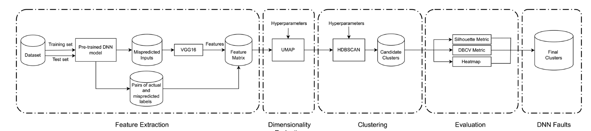

  为了评估测试集的有效性，本文提出了一种基于聚类的故障估计方法。具体步骤如下：

- **特征提取**：使用VGG-16模型提取误分类输入的特征，并构建特征矩阵。
- **降维**：由于高维空间中的低密度问题，本文使用UMAP（Uniform Manifold Approximation and Projection）进行降维处理。
- **聚类**：使用HDBSCAN（Hierarchical Density-Based Spatial Clustering of Applications with Noise）算法对误分类输入进行聚类。每个聚类对应DNN模型中的一个故障（即误分类的共同原因）。
- **验证**：通过重新训练模型来验证聚类的有效性。具体来说，使用每个聚类中的部分输入重新训练模型，并测试模型在该聚类中的准确性。如果聚类中的输入确实是由于相同的原因被误分类，重新训练后的模型在该聚类中的准确性应显著提高。

##### 实验效果

本文的实验部分旨在评估所选的多样性指标在指导深度神经网络（DNN）测试中的有效性，并与现有的白盒覆盖率标准进行比较。实验部分主要围绕以下几个研究问题展开：

1. **RQ1：所选多样性指标在多大程度上能够衡量输入集的多样性？**

   

   为了评估所选多样性指标（几何多样性 GD、标准化压缩距离 NCD 和标准差 STD）在衡量输入集多样性方面的可靠性，作者设计了一个控制实验。实验通过逐步增加输入集中的图像类别数量，观察多样性指标的变化情况。具体步骤如下：

   - **步骤1**：从数据集中随机选择一个类别 $C_i$，并从中随机抽取20个大小为100的输入集。
   - **步骤2**：计算每个输入集的多样性得分（GD、NCD、STD）。
   - **步骤3**：逐步增加输入集中的类别数量，每次增加一个类别，并保持类别在输入集中的均匀分布。
   - **步骤4**：重复步骤2和步骤3，直到输入集中包含所有类别。

   实验结果通过箱线图展示，显示了不同类别数量下多样性得分的分布情况。实验结果表明，几何多样性（GD）在衡量输入集多样性方面表现最好，随着类别数量的增加，GD得分单调递增。标准差（STD）也表现出类似的趋势，但噪声较大。而标准化压缩距离（NCD）的表现较差，得分没有随着输入集多样性的增加而显著变化，且计算时间较长。
2. **RQ2：多样性与故障检测之间的关系如何？**

   

   为了研究多样性与故障检测之间的关系，作者随机抽取了60个大小为 $n∈[100,200,300,400,1000]$ 的输入集，并计算每个输入集的多样性得分（GD和STD）以及故障数量（即覆盖的误分类输入簇的数量）。然后，使用Spearman相关系数分析多样性与故障数量之间的相关性。
   为了排除输入集多样性增加导致簇数量增加的混淆因素，作者还对整个测试数据集进行了聚类，并分析了输入集中覆盖的簇数量与故障数量之间的相关性。结果表明，多样性与故障数量之间存在显著的正相关关系，尤其是几何多样性（GD）在所有数据集和模型中都表现出与故障数量的显著正相关。
3. **RQ3：覆盖率与故障检测之间的关系如何？**

   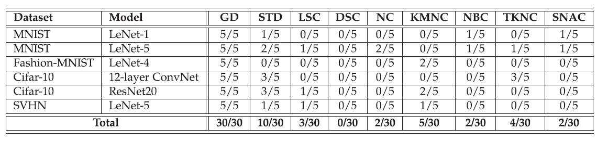

   为了研究覆盖率与故障检测之间的关系，作者选择了几个最先进的覆盖率标准，包括基于似然的惊喜覆盖率（LSC）、基于距离的惊喜覆盖率（DSC）、神经元覆盖率（NC）和DeepGauge的多个覆盖率指标（如KMNC、NBC、TKNC、SNAC）。作者使用与RQ2相同的实验方法，计算每个输入集的覆盖率得分，并分析覆盖率与故障数量之间的相关性。
   实验结果表明，覆盖率与故障数量之间的相关性较弱，大多数覆盖率指标在故障检测方面的表现不佳。只有少数覆盖率指标（如KMNC、TKNC）在某些配置下表现出与故障数量的显著正相关，但这种相关性并不一致。
4. **RQ4：多样性和覆盖率在计算时间上的表现如何？**

   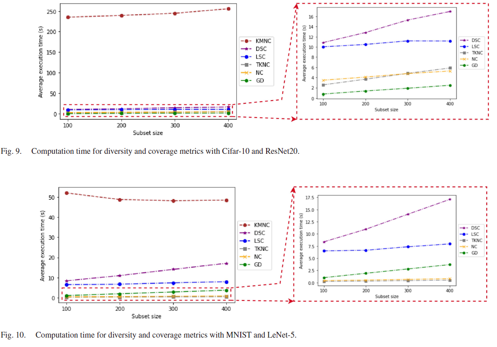

   为了比较多样性和覆盖率指标的计算时间，作者随机抽取了60个大小为 $n∈[100,200,300,400]$ 的输入集，并计算每个输入集的多样性和覆盖率得分，记录其计算时间。实验结果表明，多样性和覆盖率指标的计算时间都随着输入集大小的增加而线性增长，但几何多样性（GD）的计算时间显著短于大多数覆盖率指标。GD的计算时间比LSC和DSC快3到5倍。
5. **RQ5：多样性与覆盖率之间的关系如何？**
   为了研究多样性与覆盖率之间的关系，作者计算了每个输入集的几何多样性得分和覆盖率得分，并分析了两者之间的Spearman相关性。实验结果表明，多样性与覆盖率之间几乎没有显著的相关性，大多数配置下两者的相关性较弱。这表明，多样性的增加并不一定会导致覆盖率的增加，反之亦然。

通过上述实验，作者得出以下结论：

1. **几何多样性（GD）** 在衡量输入集多样性和故障检测方面表现最好，且计算时间较短，适合作为黑盒测试指标来指导DNN测试。
2. **覆盖率指标** 在故障检测方面的表现较差，大多数覆盖率指标与故障数量之间没有显著的相关性。
3. **多样性与覆盖率** 之间几乎没有显著的相关性，表明多样性的增加并不一定会导致覆盖率的增加。

这些结果表明，几何多样性可以作为指导DNN测试的有效指标，尤其是在无法访问DNN内部信息或训练数据的情况下。

##### 总结

本文提出了一种基于测试用例多样性的黑盒测试方法，通过几何多样性度量来指导DNN测试。实验结果表明，几何多样性在错误检测能力和计算时间上优于现有的白盒覆盖率标准，且不依赖于DNN的内部信息或训练数据。本文的研究为DNN测试提供了一种新的思路，建议在实际应用中探索几何多样性作为黑盒度量来指导测试输入集的选择、最小化或生成。未来的研究可以进一步探索其他多样性度量和特征提取模型，以扩展该方法的应用范围。

### 学习心得

通过对深度神经网络（DNN）验证和测试相关论文的深入学习，小组对DNN在安全关键领域中的应用及其验证与测试方法有了更为深刻的理解。以下是学习过程中对几个关键问题的思考与总结：

#### 1. **形式化验证与鲁棒性验证的重要性**

在DNN的验证过程中，形式化验证和鲁棒性验证是确保模型安全性的核心手段。形式化验证通过数学工具（如可达性分析、抽象解释）能够严格证明模型在特定输入空间内满足预设的安全属性，尤其是在语义分割神经网络中，形式化验证可以确保分割结果的准确性和一致性。鲁棒性验证则关注模型在面对对抗样本、噪声干扰等异常条件下的表现，确保模型在实际应用中的可靠性。

通过学习《Robustness Verification of Semantic Segmentation Neural Networks Using Relaxed Reachability》这篇论文，了解到松弛可达性方法在验证语义分割网络鲁棒性时的有效性。通过引入松弛因子（RF），该方法能够显著减少验证时间，同时保持较高的验证精度。在实际应用中，如何在验证精度和计算效率之间找到平衡是一个重要的研究方向。

#### 2. **MaxPool函数的验证挑战与解决方案**

在卷积神经网络（CNN）中，MaxPool函数虽然广泛使用，但其非线性特性使得验证变得复杂。通过学习《Towards General Robustness Verification of MaxPool-based Convolutional Neural Networks via Tightening Linear Approximation》这篇论文，了解到MaxLin框架通过紧致线性近似来解决MaxPool函数的验证问题。MaxLin通过最小化MaxPool函数的上界线性近似和最大化下界线性近似的精度，能够为CNN提供更大的认证下界。

所以，在处理非线性激活函数时，如何通过线性近似来简化验证过程是一个关键问题。MaxLin的成功在于它不仅考虑了神经元级别的紧致性，还引入了块级紧致性，从而在全局范围内优化了线性近似的精度。这为未来处理其他非线性激活函数（如ReLU、Sigmoid等）提供了新的思路。

#### 3. **基于神经元语义的测试生成方法**

在DNN的测试方面，传统的覆盖率准则（如神经元覆盖率、路径覆盖率等）虽然被广泛使用，但其在捕捉模型复杂行为方面的能力有限。通过学习《Neuron Semantic-Guided Test Generation for Deep Neural Networks Fuzzing》这篇论文，了解到NSGen方法通过引入神经元语义信息，能够生成更具多样性和可解释性的测试输入，从而更有效地揭示模型中的潜在缺陷。

NSGen的核心创新在于引入了决策路径差异（DPD）作为指导准则，通过量化原始测试输入和变异测试输入之间的语义差异，确保生成的测试输入能够有效探索DNN的决策边界。测试输入的可解释性和多样性对于发现模型中的潜在缺陷至关重要。特别是在复杂数据集（如ImageNet）上，NSGen能够生成覆盖更多类别的测试输入，从而更全面地探索模型的决策空间。

#### 4. **基于多样性的黑盒测试方法**

在DNN的黑盒测试中，传统的白盒覆盖率准则往往无法直接应用，尤其是在处理第三方提供的专有模型时。通过学习《Black-Box Testing of Deep Neural Networks through Test Case Diversity》这篇论文，了解到基于几何多样性（GD）的黑盒测试方法能够在不依赖模型内部信息的情况下，有效指导测试输入的选择和生成。

几何多样性通过衡量输入集在特征空间中的多样性，能够显著提高故障检测能力。实验结果表明，几何多样性在错误检测能力和计算时间上优于现有的白盒覆盖率标准。在实际应用中，如何通过多样性的度量来指导测试输入的选择是一个重要的研究方向。特别是在无法访问模型内部信息的情况下，几何多样性提供了一种有效的黑盒测试方法。

#### 5. **未来研究方向**

通过对这些论文的学习，我们认识到DNN的验证和测试仍然面临许多挑战。未来的研究可以从以下几个方面展开：

* **更高效的验证方法** ：如何在保证验证精度的同时，进一步减少计算复杂度，特别是在处理大规模神经网络时。
* **更全面的测试策略** ：如何通过引入更多的语义信息和多样性度量，生成更具挑战性和多样性的测试输入，从而更全面地探索模型的决策边界。
* **跨领域的应用** ：如何将现有的验证和测试方法扩展到其他类型的神经网络（如循环神经网络、Transformer等），并在更多实际应用场景中进行验证。

总的来说，DNN的验证和测试是一个复杂且充满挑战的领域，未来的研究需要进一步探索更高效的验证方法和更具针对性的测试策略，以确保DNN在实际应用中的安全性和可靠性。

[1] Tran H D, Pal N, Musau P, et al. Robustness verification of semantic segmentation neural networks using relaxed reachability[C]//Computer Aided Verification: 33rd International Conference, CAV 2021, Virtual Event, July 20–23, 2021, Proceedings, Part I 33. Springer International Publishing, 2021: 263-286.
[2] Xiao Y, Ma S, Zhai J, et al. Towards General Robustness Verification of MaxPool-based Convolutional Neural Networks via Tightening Linear Approximation[C]//Proceedings of the IEEE/CVF Conference on Computer Vision and Pattern Recognition. 2024: 24766-24775.
[3] Li Huang, Weifeng Sun, Meng Yan, Zhongxin Liu, Yan Lei, and David Lo. 2025. Neuron Semantic-Guided Test Generation for Deep Neural Networks Fuzzing. ACM Trans. Softw. Eng. Methodol. 34, 1, Article 15 (January 2025), 38 pages. https://doi.org/[10.1145/3688835](https://doi.org/10.1145/3688835)
[4]  Z. Aghababaeyan, M. Abdellatif, L. Briand, R. S and M. Bagherzadeh, "Black-Box Testing of Deep Neural Networks through Test Case Diversity," in IEEE Transactions on Software Engineering, vol. 49, no. 5, pp. 3182-3204, 1 May 2023, doi: 10.1109/TSE.2023.3243522.
